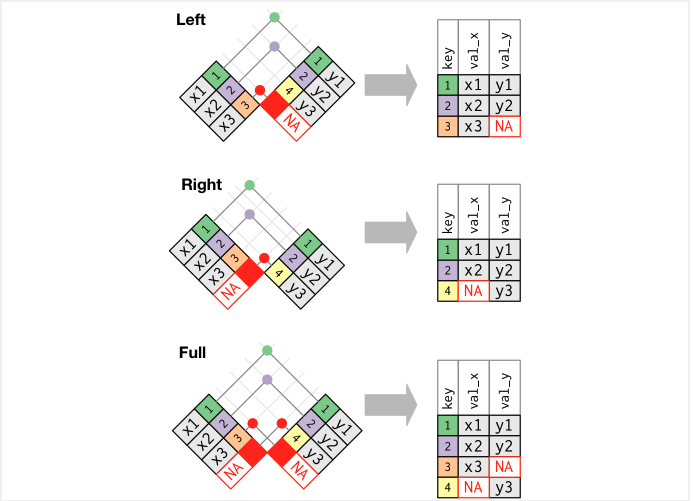

<style>
.small-code pre code {
  font-size: 0.8em;
}

.footer {
    color: black; background: #E8E8E8;
    position: fixed; top: 90%;
    text-align:left; width:100%;
}
</style>


10 Pitfalls in the course of getting tidy data in R
========================================================
author: Diandian Yi
date: December 15th, 2020
autosize: true

Motivation
========================================================

- 3 years and 80%
- Easy to use : Tidy data in a reproducible process
- Easy to remember : One case study explains a chain of pitfalls

The course of getting tidy data
========================================================

- R configuration/Dependency checking(1)
- Download and import data(2,3)
- Check the data structure of the file imported(4,5,6,8,9)
- Merge different tables(7)
- Get useful variables or summaries(10)

1. Things we need to check in advance
========================================================

Before dealing with real data, the first thing is to check package installation, library loading and file path. 


```r
?preProcess
```

```
No documentation for 'preProcess' in specified packages and libraries:
you could try '??preProcess'
```

Usually it is easy to check everything by writing straight R code at the console. How to make it reproducible?

1. Things we need to check in advance(2)
========================================================
class: small-code
We can use functions to do these checking, then download data:


```r
# Dependency checking
check_pkg_deps <- function() {
  if(!require(dplyr)) {
    message("installing the 'dplyr' package")
    install.packages("dplyr")
  }
  if(!require(readr))
    stop("the 'readr' package needs to be installed first")
}

# Download files
download_data <- function(url,dest_name){
  check_pkg_deps()
  
  # Check arguments
  if(!is.character(url))
    stop("'url' should be character")
  if(!is.character(dest_name))
    stop("'dest_name' should be character")
  
  # Construct file path
  dest <- file.path("./data", dest_name)
  if(!file.exists(dest)) {
    val <- download.file(url, dest, quiet = TRUE)
  }
}

my_url <- "https://d3c33hcgiwev3.cloudfront.net/_f018d9fe5547b1a722ce260af0fa71af_quiz_data.zip?Expires=1607644800&Signature=b2uccYsONgiFcvHWEhr-l-nBW8JKhrNJGxgtGsow46lKSMV4UYB7FodxMb~UiZXM47He6H7yZa7CpwemTbL1q02G0NXvU-rIb68VDCu~Tg3asPjlq-~MZKmn4dJDWlXB~0~tVRbgFsJ0WkrcmJySS4jdHCY5Y1z76RVrxhsUkzA_&Key-Pair-Id=APKAJLTNE6QMUY6HBC5A"

download_data(my_url,"Data.zip")
```

2. Downloading big data sources
========================================================

Two packages I used most:
- In-memory strategies: data.table;
- Out-memory strategies: RMySQL, RSQLServer

3. File column types
========================================================

Easy way to specify the column type when read tabular data using "readr" package.

```r
daily_SPEC_2014 <- read_csv("data/daily_SPEC_2014.csv.bz2", col_types="cccccddccccDccdddddcccccccccD")

# If we only want to read subset of the columns
First_two_cols <- read_csv("data/daily_SPEC_2014.csv.bz2", 
                     col_types = cols_only('State Code' = col_character(), 'County Code' = col_character()),
                     n_max = 10)
```

There are also ways to show "guess" column type or skip some columns' specification.

4. Name for different objects
========================================================
Given the following data frame, how do I create a new column called "3" that contains the sum of 1 and 2?

```r
df <- data.frame(runif(3), runif(3))
names(df) <- c(1,2)
```

A syntactic name in R must consist of letters, digits, . and _ but can't begin with _ or a digit. And no reserved words like TRUE, NULL, if and function. 

It's still possible to override these rules and use any name by surrounding it with backticks.

5. Combining and coercion
========================================================

What happened if there's no specification for types of subjects in R? 

```r
str(c(First_two_cols$`State Code`,1))
```

```
 chr [1:11] "01" "01" "01" "01" "01" "01" "01" "01" "01" "01" "1"
```

Combining different types will lead to coercion in a fixed order: character -> double -> integer -> logical

6. NULL & NA
========================================================
class: small-code
NULL is a special data structure which has length zero. It represnet an empty vector, or it represent an absent vector. Contrast this with NA which is used to indicate that an  *element* of a vector is absent.

```r
w <- c()
w
```

```
NULL
```

```r
is.null(w)
```

```
[1] TRUE
```

```r
y <- c(1,2,3)
c(w,y)
```

```
[1] 1 2 3
```
***
NA means "not applicable". As a missing value, most computatious involving a missing value will return another missing value.

```r
x <- c(NA, 5, NA, 10)
x == NA
```

```
[1] NA NA NA NA
```

```r
is.na(x)
```

```
[1]  TRUE FALSE  TRUE FALSE
```

```r
y <- c(1,2,3)
c(x,y)
```

```
[1] NA  5 NA 10  1  2  3
```


7. Join problems-Mutating joins
========================================================


- Duplicate keys
- Missing values in keys

7. Join problems(2)-Filtering joins
========================================================
<div class="footer" style="margin-top:-3px;font-size:40%;">
Figures in this part were extracted from Chapter13.Relational data of R for Data Science, by Hadley Wickham & Garrett Grolemund.</div>

Mutating joins:

***
Filtering joins:
Semi-join:

Anti-join:

For filtering joins, duplicate key does't matter:


8. Special data type: Factor
========================================================
class: small-code
As being more self-describing when labeling categorical data, factor can be unordered or ordered. 

```r
x <- factor(c("female","female","male","female","male"))
x
```

```
[1] female female male   female male  
Levels: female male
```

```r
y <- factor(c("female","female","male","female","male"),
            levels = c("male", "female"))
y
```

```
[1] female female male   female male  
Levels: male female
```

Factors are treated specially by modelling functions. And factors are also especially useful when we create plot or sort data in certain order.

9. Special data type: Date
========================================================
class: small-code
Base R28 provides two ways of storing date-time information, POSIXct, and POSIXlt.

```r
library(lubridate)
now()
```

```
[1] "2020-12-11 14:05:12 CET"
```

```r
structure(now(), tzone = "Europe/Paris")
```

```
[1] "2020-12-11 14:05:12 CET"
```

```r
structure(now(), tzone = "Asia/Tokyo")
```

```
[1] "2020-12-11 22:05:12 JST"
```

```r
structure(now(), tzone = "America/New_York")
```

```
[1] "2020-12-11 08:05:12 EST"
```

```r
structure(now(), tzone = "Australia/Lord_Howe")
```

```
[1] "2020-12-12 00:05:12 +11"
```

10. Profiling: loops and tidyverse
========================================================
class: small-code
Use loop to create a new column:

```r
If_Recards <- function(data, threshold){
  highest_mean <- c()
  record_mean <- c()
  for(i in 1:nrow(data)){
    highest_mean <- max(highest_mean, data$'Arithmetic Mean'[i])
    record_mean <- data$'Arithmetic Mean'[i]>=threshold &
      data$'Arithmetic Mean' >= highest_mean
  }
  data <- cbind(data, record_mean)
  return(data)
}
```
***
Use tidyverse to create a new column:

```r
If_Recards_2 <- function(data, threshold){
  data <- data %>% 
    mutate(over_shreshold='Arithmetic Mean'>=threshold,
           cummax_mean = 'Arithmetic Mean' == cummax('Arithmetic Mean'),
           record_mean = over_shreshold & cummax_mean) %>% 
    select_(.dots = c("-over_threshold", "-cummax_mean"))
  return(data)
}
```

10. Profiling: loops and tidyverse(2)
========================================================

To profile the code efficiency

```r
library(microbenchmark)
microbenchmark(a <- rnorm(1000), 
               b <- mean(rnorm(1000)))
```

```
Unit: microseconds
                   expr    min     lq     mean  median      uq     max neval
       a <- rnorm(1000) 56.644 57.756 63.92176 58.4245 61.6965 108.295   100
 b <- mean(rnorm(1000)) 60.664 61.977 75.14866 62.9965 67.2160 274.618   100
```

References
========================================================
Hadley Wickham & Garrett Grolemund 2020, R for Data Science(Chapter11-16),accessed 11 Dec 2020, <https://r4ds.had.co.nz/index.html>. 

Hadley Wickham 2020, Advanced R(Chapter2-7),accessed 11 Dec 2020, <https://adv-r.hadley.nz/index.html>. 

Roger D. Peng, Sean Kross, and Brooke Anderson 2020, Mastering Software Development in R(Chapter1, Chapter2.7),accessed 11 Dec 2020, <https://bookdown.org/rdpeng/RProgDA/>. 

Thank you and Merry Christmas!
========================================================

